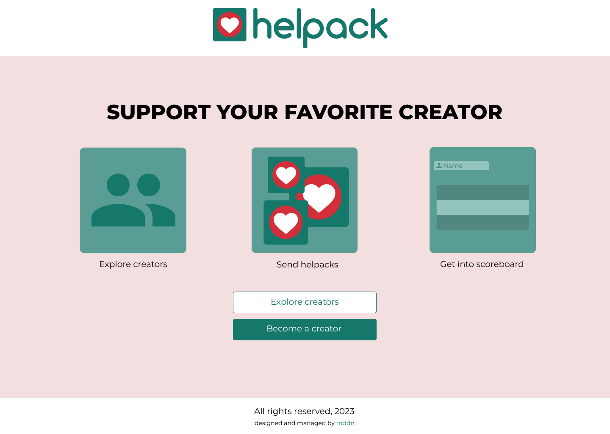
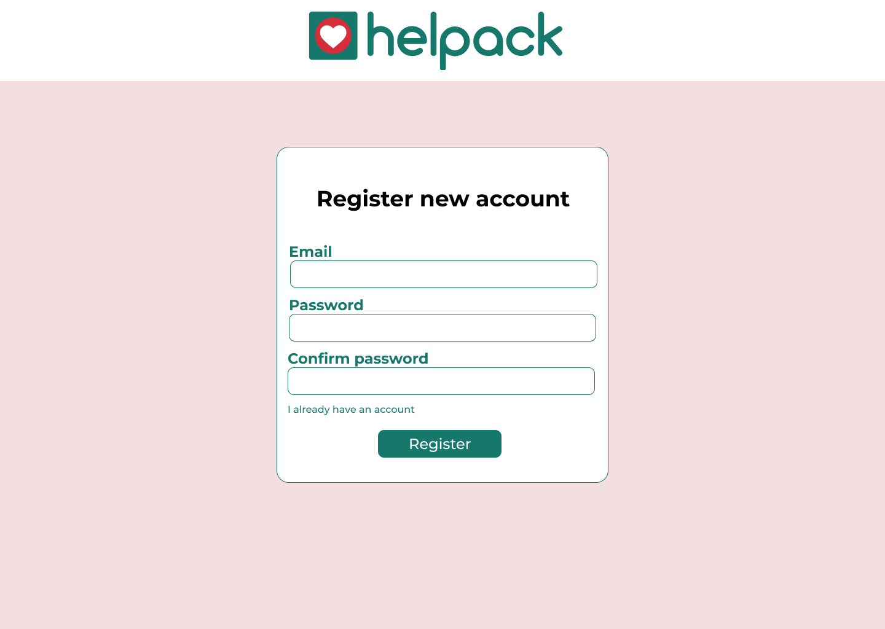
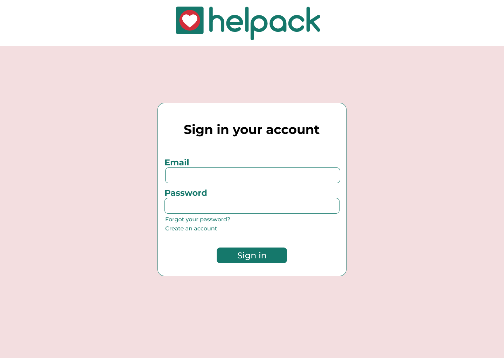
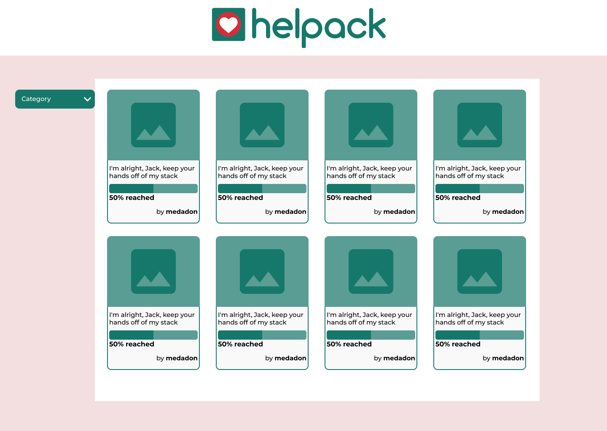
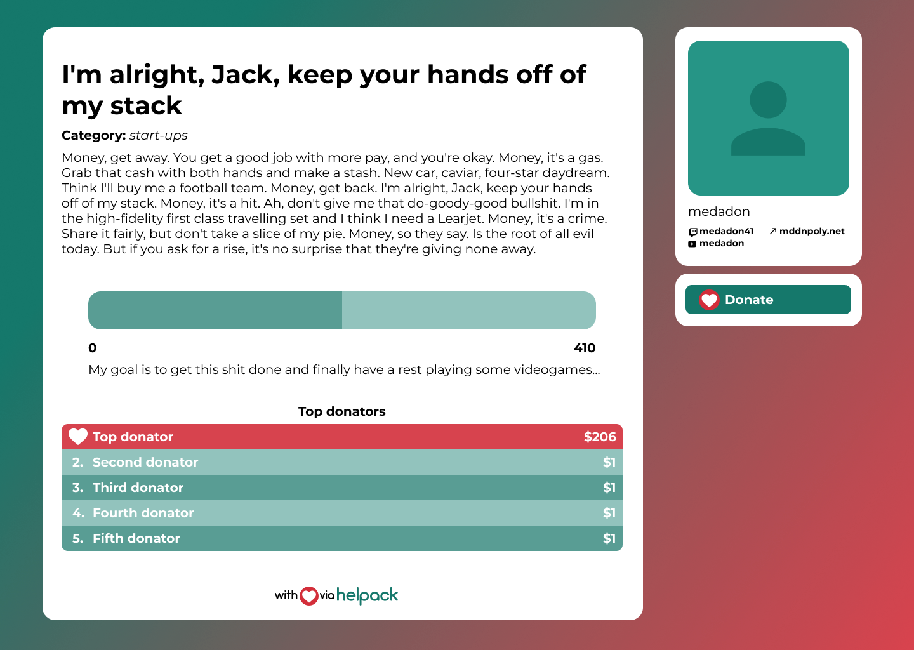
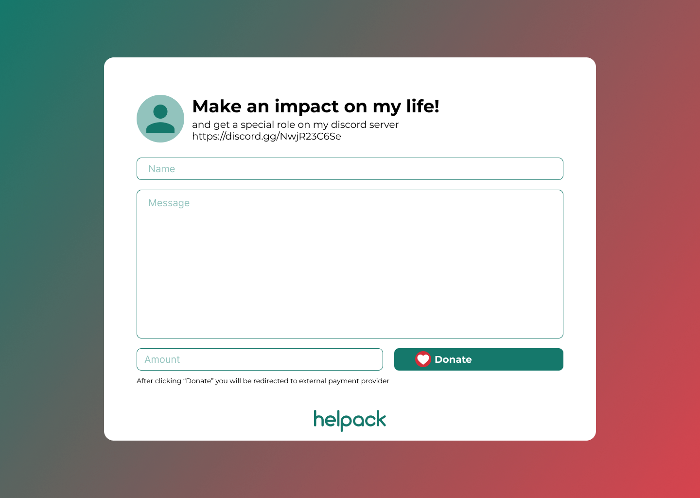
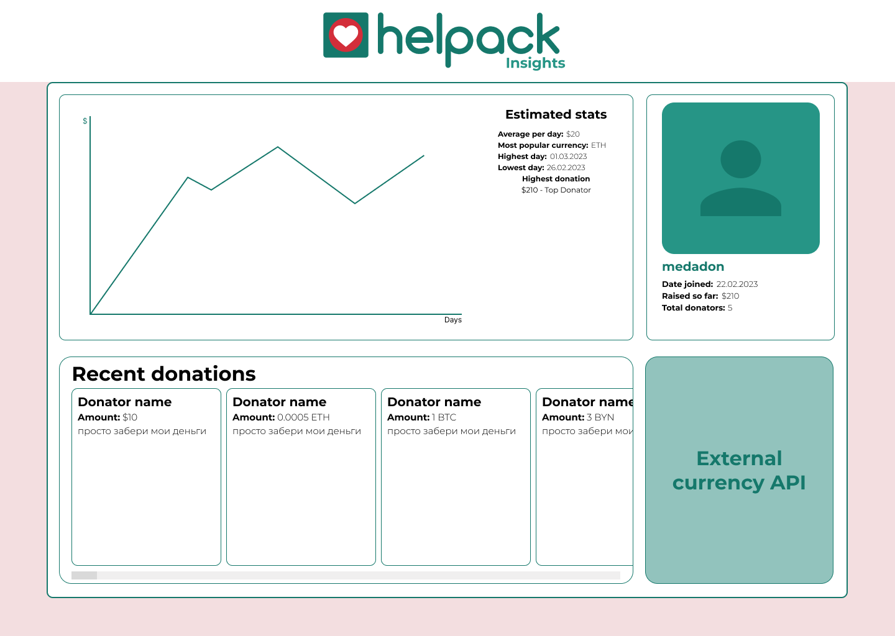

# helpack — crowdfunding service

## Описание

**helpack** — сервис, позволяющий авторам различного уровня (от стримеров до больших благотворительных проектов) собирать средства для поддержания своей деятельности. Донатеры в свою очередь, могут написать свои идеи или пожелания автору в сообщении при совершении пожертвования, а также показать размер своей доброты в таблице топ-5 донатеров определенного проекта.

## Функциональные возможности

  * **Регистрация и авторизация** — только для авторов, для донатеров регистрация не требуется
  * **Наполнение профиля** — авторы имеют возможность изменить описание своего профиля (например, описание проекта), описать свои цели (собираемое количество денег и цель сбора), а также специальный текст непосредственно на странице с пожертвованием.
  * **Таблица наибольших пожертвований** — на странице проекта выводится таблица топ-5 самых больших пожертвований.
  * **Статистика** — на внутренней странице автора выводится статистика его проекта: график объема донатов по дням, среднее значение за промежуток и прочие данные.
  * **Сообщения донатеров** — также на внутренней странице автора есть специальный блок, в котором показываются имя донатера, его сообщение, а также сумма доната.
  * **Конвертер** — быстрый доступ прямо на внутренней странице автора к курсам выбранных валют (криптокоины и фиатные валюта).

## Сущности базы данных

### User
| Имя поля | Тип 
|-----------|:-----------:|
| Id | pk |
| UserName | VARCHAR(50) |
| Email | VARCHAR(50) |
| Balance | NUMBER |

### Donation
| Имя поля | Тип 
|-----------|:-----------:|
| Id | pk |
| Receiver | FK |
| Amount | NUMBER |

### PaymentInfo
| Имя поля | Тип 
|-----------|:-----------:|
| Id | pk |
| Owner | FK |
| Type | VARCHAR(50) |
| Number | VARCHAR(64) |

### TBA

## Примерный дизайн

### Приветствующая страница

### Страница регистрации

### Страница входа

### Обзор проектов

### Страница проекта

### Страница доната

### Внутренняя страница автора

### Настройки профиля

### Настройки аккаунта

